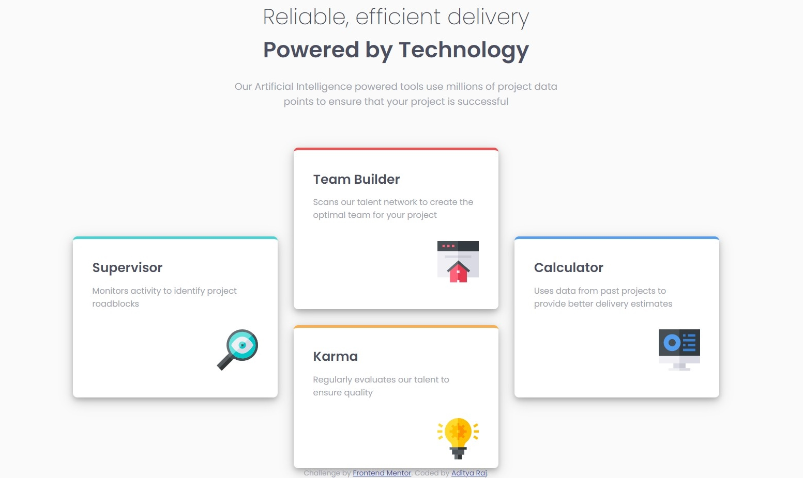

# Frontend Mentor - Four card feature section solution

This is a solution to the [Four card feature section challenge on Frontend Mentor](https://www.frontendmentor.io/challenges/four-card-feature-section-weK1eFYK). Frontend Mentor challenges help you improve your coding skills by building realistic projects. 

## Table of contents

- [Overview](#overview)
  - [The challenge](#the-challenge)
  - [Screenshot](#screenshot)
  - [Links](#links)
- [My process](#my-process)
  - [Built with](#built-with)
  - [What I learned](#what-i-learned)
  - [Continued development](#continued-development)
  - [Useful resources](#useful-resources)
- [Author](#author)
- [Acknowledgments](#acknowledgments)

## Overview

This is a challenge done by me (Aditya Raj) on frontendmentor.io in which I had to make a four card section component.

### The challenge

Users should be able to:

- View the optimal layout for the site depending on their device's screen size

### Screenshot

### Links

- Solution URL: [Solution link](https://www.frontendmentor.io/solutions/four-card-feature-section-css-grid-RyP1BPD9NH)
- Live Site URL: [Live link](https://adityaraj5200-four-card-feature-section.netlify.app/)

### Built with

- Semantic HTML5 markup
- CSS Grid

## Author

- Frontend Mentor - [@adityaraj5200](https://www.frontendmentor.io/profile/adityaraj5200)
- Twitter - [@adityaraj5200](https://www.twitter.com/adityaraj5200)
